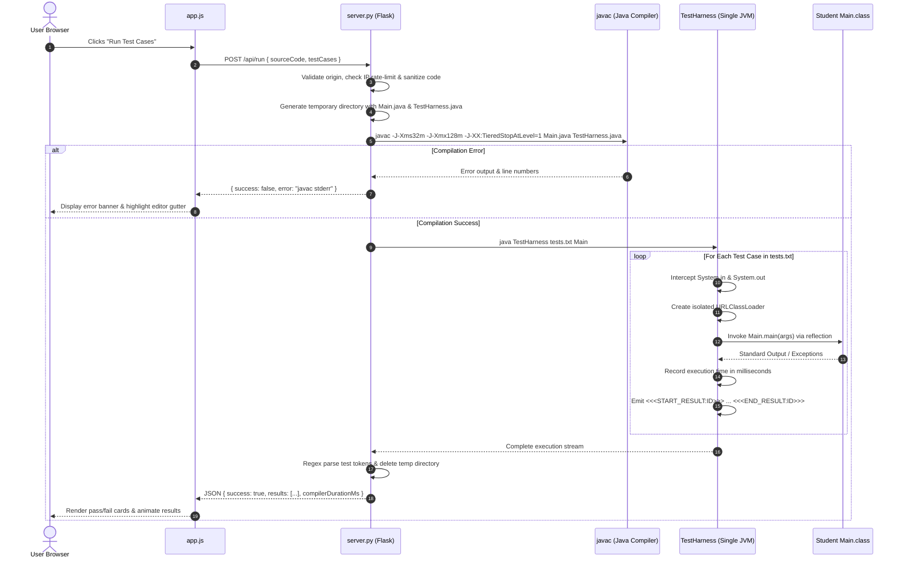

# Technical System Architecture (ARCHITECTURE.md)
## Java Practice Compiler & Automated Test Bench

> **Scope:** High-level system topology, data flow, IPC protocols, and sandboxed compilation lifecycle.

---

## 1. High-Level Architecture Topology

The application is structured as a decoupled **Single Page Application (SPA)** communicating over asynchronous JSON HTTP APIs with a **Stateless Python Compilation Microservice**.

```
                        ┌────────────────────────────────────────────────────────┐
                        │              Client Browser (Edge / CDN)               │
                        │                                                        │
                        │   index.html  ◄──►  style.css  ◄──►  questions.js      │
                        │        ▲                                   ▲           │
                        │        │                                   │           │
                        │        ▼                                   ▼           │
                        │   app.js (CodeMirror, UI Controller, Visualizers)      │
                        └───────────────────────────┬────────────────────────────┘
                                                    │
                                                    │ HTTP POST /api/run
                                                    │ Payload: { sourceCode, testCases, stdin }
                                                    ▼
                        ┌────────────────────────────────────────────────────────┐
                        │          Execution Engine (server.py / app.py)         │
                        │          (Flask / Gunicorn / Python 3.11)              │
                        │                                                        │
                        │   1. Origin Check & Rate Limiter Guard                 │
                        │   2. Source Code Sanitizer (strips package, adds I/O)  │
                        │   3. Temp Workspace Creation (/tmp/sandboxes/uuid)     │
                        │   4. Fast JIT Javac Compilation                        │
                        │   5. Single-JVM Execution via TestHarness.java         │
                        │   6. ClassLoader Isolation & Output Regex Extraction  │
                        │   7. Cleanup & JSON Response Dispatch                  │
                        └────────────────────────────────────────────────────────┘
```

---

## 2. Component Breakdown & Responsibilities

### 2.1 Frontend Tier (`index.html`, `style.css`, `app.js`, `questions.js`)
- **`questions.js` (Data Repository):**
  - Defines the global `window.PROBLEMS` dictionary containing 120+ challenges.
  - Exposes test cases (inputs/expected outputs), Big-O metrics, starter templates, and reference solutions.
- **`app.js` (Client Controller):**
  - **Editor Initialization:** Configures CodeMirror 5 with clike mode, matchbrackets, closebrackets, and custom auto-completion snippets.
  - **State Machine:** Tracks current challenge slug, solved problem set in `localStorage`, active theme, and visualizer playback state.
  - **Algorithm Visualizer Generator:** Dynamically creates multi-step animated visualizers (2D DP tables, linked lists, trees, graphs, sorting bars).
  - **Execution Orchestrator:** Dispatches compilation requests to `/api/run` or `/api/custom-run`, parses results, highlights test case rows, and triggers confetti on full pass.
- **`style.css` (Presentation Layer):**
  - Global CSS variables for Dracula Dark and Studio Light themes.
  - Layout definitions: Responsive workspace grid, CodeMirror gutters, scrubber controls, and DP table grids.

---

## 3. Sandboxed Code Execution Pipeline

To achieve ultra-fast evaluations without spinning up a fresh JVM per test case (which would cause 3–6 second latencies), the backend uses an **in-memory Single-JVM Test Harness** with classloader isolation.

### Step-by-Step Lifecycle



### Why ClassLoader Isolation Matters:
If a student's solution uses `static int counter = 0;` and increments it, running Test 2 in the same JVM without a fresh classloader would start with `counter` contaminated by Test 1. A new `URLClassLoader` instantiated per test case guarantees clean static state for every test case.

---

## 4. API Endpoints Reference

### 4.1 `POST /api/run`
Executes pre-defined test cases for an existing problem.
- **Request Headers:** `Content-Type: application/json`
- **Request Body:**
  ```json
  {
    "sourceCode": "public class Main { ... }",
    "testCases": [
      { "id": 1, "input": "5\n1 2 3 4 5", "expected": "15" },
      { "id": 2, "input": "3\n10 20 30", "expected": "60" }
    ]
  }
  ```
- **Response Body (Success):**
  ```json
  {
    "success": true,
    "compilerDurationMs": 142.8,
    "results": [
      {
        "id": 1,
        "status": "passed",
        "actual": "15",
        "expected": "15",
        "durationMs": 3.8
      }
    ]
  }
  ```

### 4.2 `POST /api/custom-run`
Executes student code with user-supplied custom STDIN.
- **Request Body:**
  ```json
  {
    "sourceCode": "...",
    "stdin": "4 7 2 9"
  }
  ```
- **Response Body:**
  ```json
  {
    "success": true,
    "output": "Result: 9\n",
    "durationMs": 4.1,
    "compilerDurationMs": 138.2
  }
  ```

---

## 5. Deployment & Infrastructure

- **Vercel (Static Frontend):** Serves `index.html`, `style.css`, `app.js`, `questions.js`, and static assets directly from edge CDNs.
- **Render / Heroku / Docker (Backend Service):** Hosts `server.py` using `gunicorn` on Python 3.11 with OpenJDK 17/21 installed.
- **Local Dev (`run.bat`):** Starts local Flask server on `http://localhost:4060` with hot-reloading.
